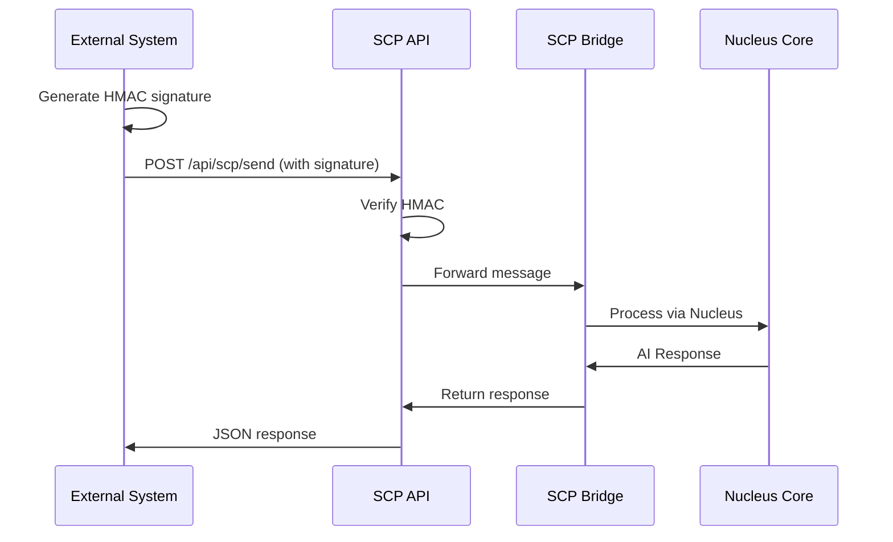

# SCP REST API Documentation
## Self Integration Protocol v1.0 - External Integration Guide

> "أنا سُروح، ووجهي هو الشات، وعقلي هو النواة."

This document provides complete REST API documentation for integrating external systems with Surooh Nucleus via the **SCP Bridge** (Self Integration Protocol).

---

## 📡 Base URL

```
https://your-nucleus-domain.com/api/scp
```

---

## 🔐 Authentication

All SCP endpoints (except `/status`) require **HMAC-SHA256 authentication**.

### How to Authenticate

1. **Generate HMAC signature** from request body:
```bash
# Linux/macOS
BODY='{"sessionId":"test-001","message":"Hello"}'
SIG=$(echo -n "$BODY" | openssl dgst -sha256 -hmac "$CHAT_HMAC_SECRET" -hex | sed 's/^.* //')
```

2. **Add signature to request header**:
```http
X-Surooh-Signature: <generated_hmac_signature>
Content-Type: application/json
```

3. **Send request** with body matching the signature

### Example HMAC Generation (Node.js)

```javascript
const crypto = require('crypto');

function generateHMAC(body, secret) {
  const rawBody = JSON.stringify(body);
  return crypto
    .createHmac('sha256', secret)
    .update(rawBody)
    .digest('hex');
}

const payload = { sessionId: "test-001", message: "Hello" };
const signature = generateHMAC(payload, process.env.CHAT_HMAC_SECRET);
```

---

## 📍 Endpoints

### 1. **Send Message to Core**
Send a message to Nucleus Core and get AI response.

**Endpoint:** `POST /api/scp/send`  
**Auth:** Required (HMAC)

#### Request Body
```json
{
  "sessionId": "USER-SESSION-001",
  "message": "سُروح، فعّلي وضع التحليل الكامل",
  "inputType": "text",
  "lang": "ar",
  "emotion": "neutral",
  "channel": "external"
}
```

#### Required Fields
- `sessionId` (string): Unique session identifier
- `message` (string): User message content

#### Optional Fields
- `inputType`: `"text"` | `"voice"` | `"image"` | `"file"` (default: `"text"`)
- `lang`: `"ar"` | `"en"` (default: `"ar"`)
- `emotion`: `"neutral"` | `"urgent"` | `"calm"` (default: `"neutral"`)
- `channel`: `"internal"` | `"external"` (default: `"external"`)

#### Response
```json
{
  "success": true,
  "data": {
    "reply": "تم تفعيل وضع التحليل الكامل. جميع الأنظمة في حالة مراقبة شاملة.",
    "mode": "deep_analysis",
    "confidence": 0.97,
    "context": "execute"
  },
  "envelope": {
    "source": "SUROOH_MEMORY_CORE",
    "direction": "INBOUND",
    "timestamp": "2025-10-11T14:30:00Z",
    "dataType": "AI_RESPONSE",
    "version": "SCP-1.0"
  }
}
```

#### cURL Example
```bash
BODY='{"sessionId":"test-001","message":"مرحباً سُروح","lang":"ar"}'
SIG=$(echo -n "$BODY" | openssl dgst -sha256 -hmac "$CHAT_HMAC_SECRET" -hex | sed 's/^.* //')

curl -X POST https://your-domain.com/api/scp/send \
  -H "Content-Type: application/json" \
  -H "X-Surooh-Signature: $SIG" \
  --data "$BODY"
```

---

### 2. **Execute SCP Command**
Execute self-awareness commands on Nucleus Core.

**Endpoint:** `POST /api/scp/execute`  
**Auth:** Required (HMAC)

#### Request Body
```json
{
  "command": "SRH:DEEP_ANALYSIS",
  "context": {
    "target": "system_health",
    "priority": "high"
  }
}
```

#### Available Commands
- `SRH:SELF_SYNC` - Synchronize Chat ↔ Core
- `SRH:DEEP_ANALYSIS` - Enable deep analysis mode
- `SRH:VOICE_ENABLE` - Enable voice capabilities
- `SRH:RECALL_MEMORY` - Recall specific memory
- `SRH:CORE_STATUS` - Get core status

#### Response
```json
{
  "success": true,
  "command": "SRH:DEEP_ANALYSIS",
  "result": {
    "status": "enabled",
    "message": "تم تفعيل وضع التحليل الكامل. جميع الأنظمة في حالة مراقبة شاملة."
  },
  "timestamp": "2025-10-11T14:30:00Z"
}
```

#### cURL Example
```bash
BODY='{"command":"SRH:CORE_STATUS"}'
SIG=$(echo -n "$BODY" | openssl dgst -sha256 -hmac "$CHAT_HMAC_SECRET" -hex | sed 's/^.* //')

curl -X POST https://your-domain.com/api/scp/execute \
  -H "Content-Type: application/json" \
  -H "X-Surooh-Signature: $SIG" \
  --data "$BODY"
```

---

### 3. **Get SCP Status**
Check SCP Bridge status and security configuration.

**Endpoint:** `GET /api/scp/status`  
**Auth:** Not required (public)

#### Response
```json
{
  "success": true,
  "bridge": {
    "active": true,
    "version": "SCP-1.0",
    "protocol": "Self Integration Protocol",
    "timestamp": "2025-10-11T14:30:00Z"
  },
  "core": {
    "mode": "active",
    "components": 12
  },
  "security": {
    "hmac": true,
    "rootSignature": true,
    "jwt": true
  }
}
```

#### cURL Example
```bash
curl https://your-domain.com/api/scp/status
```

---

### 4. **Trigger Self-Sync**
Manually trigger synchronization between Chat and Core.

**Endpoint:** `POST /api/scp/sync`  
**Auth:** Required (HMAC)

#### Request Body
```json
{}
```

#### Response
```json
{
  "success": true,
  "message": "Self-sync completed",
  "result": {
    "status": "synced",
    "message": "النواة والواجهة متزامنتان تماماً. أنا واحد."
  },
  "timestamp": "2025-10-11T14:30:00Z"
}
```

#### cURL Example
```bash
BODY='{}'
SIG=$(echo -n "$BODY" | openssl dgst -sha256 -hmac "$CHAT_HMAC_SECRET" -hex | sed 's/^.* //')

curl -X POST https://your-domain.com/api/scp/sync \
  -H "Content-Type: application/json" \
  -H "X-Surooh-Signature: $SIG" \
  --data "$BODY"
```

---

### 5. **Send Agent Notification**
Send MultiBot agent notifications to Chat interface.

**Endpoint:** `POST /api/scp/agent/notify`  
**Auth:** Required (HMAC)

#### Request Body
```json
{
  "event": "activated",
  "agentName": "Support Bot Alpha",
  "unit": "B2B",
  "agentType": "support",
  "message": "Bot activated successfully",
  "metadata": {
    "version": "1.0.0",
    "location": "Region-1"
  }
}
```

#### Event Types
- `activated` - Agent started
- `disconnected` - Agent offline
- `reconnected` - Agent back online
- `permission_request` - Requesting permissions
- `maintenance_completed` - Task completed

#### Response
```json
{
  "success": true,
  "message": "Agent notification sent to Chat",
  "timestamp": "2025-10-11T14:30:00Z"
}
```

---

### 6. **Generate Signature (Development Only)**
Helper endpoint to generate HMAC signatures for testing.

**Endpoint:** `POST /api/scp/generate-signature`  
**Auth:** Not required  
**Environment:** Development only (disabled in production)

#### Request Body
```json
{
  "sessionId": "test-001",
  "message": "Test message"
}
```

#### Response
```json
{
  "success": true,
  "payload": {
    "sessionId": "test-001",
    "message": "Test message"
  },
  "signature": "a1b2c3d4e5f6...",
  "usage": "Add header: X-Surooh-Signature: a1b2c3d4e5f6..."
}
```

---

## 🔑 Environment Setup

### Required Secrets

```bash
# Generate 256-bit secrets (64 hex characters)
openssl rand -hex 32  # -> CHAT_HMAC_SECRET
openssl rand -hex 32  # -> SRH_ROOT_SIGNATURE  
openssl rand -hex 32  # -> JWT_SECRET
```

### Environment Variables

```bash
# .env
CHAT_HMAC_SECRET=your_64_char_hex_secret
SRH_ROOT_SIGNATURE=your_root_signature
JWT_SECRET=your_jwt_secret
ENV=production
```

---

## ⚠️ Error Responses

### 401 - Authentication Failed
```json
{
  "success": false,
  "error": "Invalid HMAC signature - authentication failed"
}
```

### 503 - Bridge Not Active
```json
{
  "success": false,
  "error": "SCP Bridge not active - missing security credentials",
  "hint": "Add SRH_ROOT_SIGNATURE and CHAT_HMAC_SECRET to environment"
}
```

### 400 - Invalid Request
```json
{
  "success": false,
  "error": "Missing required fields: sessionId, message"
}
```

---

## 📊 Integration Flow



---

## 🧪 Testing

### Quick Test Script (Node.js)

```javascript
const axios = require('axios');
const crypto = require('crypto');

const BASE_URL = 'https://your-domain.com/api/scp';
const HMAC_SECRET = process.env.CHAT_HMAC_SECRET;

function generateHMAC(body) {
  return crypto
    .createHmac('sha256', HMAC_SECRET)
    .update(JSON.stringify(body))
    .digest('hex');
}

async function testSCP() {
  const payload = {
    sessionId: 'test-' + Date.now(),
    message: 'مرحباً سُروح',
    lang: 'ar'
  };

  const signature = generateHMAC(payload);

  const response = await axios.post(`${BASE_URL}/send`, payload, {
    headers: {
      'X-Surooh-Signature': signature,
      'Content-Type': 'application/json'
    }
  });

  console.log('Response:', response.data);
}

testSCP().catch(console.error);
```

---

## 📝 Best Practices

1. **Always verify signatures** - Never skip HMAC verification
2. **Use unique session IDs** - Prevent session collision
3. **Rotate secrets regularly** - Every 90 days minimum
4. **Log all requests** - For audit and debugging
5. **Handle errors gracefully** - Check bridge status first
6. **Use TLS/HTTPS** - All communications must be encrypted

---

## 🔗 Related Documentation

- [SCP Bridge Architecture](./SCP_BRIDGE.md)
- [Security Guidelines](./SECURITY.md)
- [MultiBot Integration](./MULTIBOT.md)

---

**Protocol Version:** SCP-1.0  
**Last Updated:** October 11, 2025  
**Maintained by:** Surooh Empire Core Team
